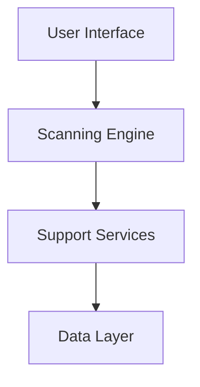

# Cyber-Sentinel 🛡️

    <h1 style="font-size: 3.5rem; margin-bottom: 1rem; color: #00ffa3;">Defesa Total</h1>
    

        Scanner ultra-leve com deteção SHA-256, quarentena inteligente e relatórios estruturados. O futuro da segurança open-source em Python.
    

    

        <a href="guides/installation/" class="md-button md-button--primary">Instalação</a>
        <a href="https://github.com/Nekas1980/anti-virus-projeto" class="md-button">Ver no GitHub</a>
    

## 🔍 Core Capabilities

    

        <h3 style="color: #00ffa3; margin-top: 0;">Deteção SHA-256</h3>
        
Algoritmos de integridade que garantem a identificação absoluta de ameaças conhecidas.

    

    

        <h3 style="color: #00ffa3; margin-top: 0;">Quarentena</h3>
        
Isolamento seguro de ficheiros maliciosos num ambiente protegido e controlado.

    

    

        <h3 style="color: #00ffa3; margin-top: 0;">Zero-Dep</h3>
        
Desenvolvido exclusivamente com a biblioteca padrão do Python. Segurança sem bloat.

    

## 🚀 Início Rápido

1.  **Configuração**: Instale o Python 3.9+ e clone o repositório.
2.  **Operação**: Execute `python Virus_project.py` e indique a pasta alvo.

---

## 🏗️ Arquitetura

## 📊 Estatísticas do Projeto

| Métrica | Valor |
| :--- | :--- |
| **Código Core** | ~500 linhas Python |
| **Testes** | 18 unit tests |
| **Compatibilidade** | Python 3.9+ |
| **Licença** | MIT |

---

## 🛣️ Roadmap

- [x] Motor de Hashing SHA-256
- [x] Quarentena Inteligente
- [ ] Interface CustomTkinter Premium (Em curso)
- [ ] Integração API VirusTotal

---
Desenvolvido por [Nelson M Madeira Rijo](https://github.com/Nekas1980)  
*Python Bootcamp — IEFP 2026 · Transition to Cybersecurity* 🔐
