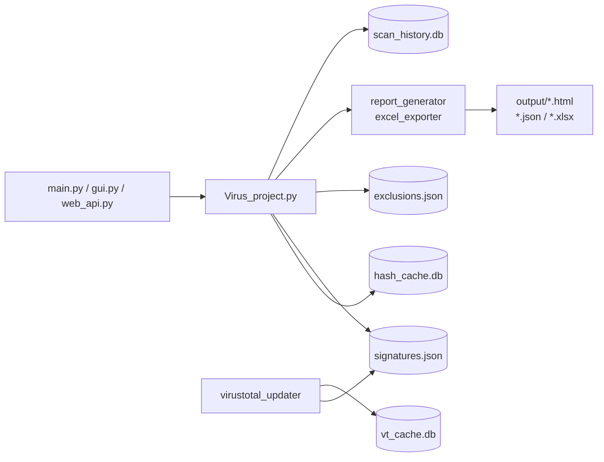

# Antivírus Projeto

<div class="hero" markdown>

## Motor educacional de deteção de malware

Detecção por **SHA-256** com cache, exclusões pré-compiladas, integração opcional com **VirusTotal**, GUI moderna em CustomTkinter, **Web API REST** (FastAPI) e relatórios HTML / JSON / Excel com gráficos Chart.js.

Construído no IEFP Cybersecurity Bootcamp como projeto pedagógico — código limpo, testes abundantes (130+ testes, ≥80% coverage), CI cross-platform.

<div class="actions" markdown>
[Começar :material-rocket-launch:](guides/installation.md){ .md-button .md-button--primary }
[Ver no GitHub :material-github:](https://github.com/Nekas1980/anti-virus-projeto){ .md-button }
</div>

</div>

---

## Funcionalidades

<div class="feature-grid" markdown>

<div markdown>
### :material-magnify: Engine SHA-256
Hashing com cache SQLite (invalidado por mtime/size), timeout por ficheiro, matcher de exclusões pré-compilado.
</div>

<div markdown>
### :material-shield-alert: Quarentena
Isolamento de binários infectados com renomeação anti-colisão para uma pasta `quarantine/`.
</div>

<div markdown>
### :material-chart-donut: Relatórios
HTML interativo com Chart.js (doughnut + bar), JSON estruturado e Excel multi-sheet (Summary/Infected/Clean/Stats).
</div>

<div markdown>
### :material-cloud-search: VirusTotal
Enriquecimento opcional com cache local (TTL 30 dias) + rate limiter token-bucket (4 req/min, free tier).
</div>

<div markdown>
### :material-monitor-dashboard: GUI Cyber-Sentinel
CustomTkinter com tabs LOG/RESULTADOS/EXPORTAR, filtros pesquisáveis, métricas live (`files/s · ETA`) e Pausar/Retomar.
</div>

<div markdown>
### :material-api: Web API
FastAPI opcional: `/api/scan`, `/api/history`, `/api/reports/{id}/{html|json|xlsx}`. Pronto para dashboards externos.
</div>

</div>

---

## Quick start

```bash
git clone https://github.com/Nekas1980/anti-virus-projeto.git
cd anti-virus-projeto
python -m venv venv && source venv/bin/activate
pip install -r requirements.txt

python main.py            # GUI
python Virus_project.py   # CLI
```

Para passos detalhados ver [Instalação](guides/installation.md) e [Início Rápido](guides/quickstart.md).

---

## Arquitetura num relance



Detalhe completo em [Arquitetura](architecture/architecture.md).

---

## Estado do projeto

| Camada | Estado | Notas |
|--------|--------|-------|
| Core scanning | ✅ Estável | SHA-256, cache, exclusions, timeout |
| Reports | ✅ Estável | HTML/JSON/Excel com metadata |
| GUI | ✅ Estável | Tabs, filtros, pause/resume |
| Web API | ✅ Estável | FastAPI opcional |
| VirusTotal | ✅ Estável | Cache + rate limit |
| Tests / CI | ✅ Estável | 130 testes, coverage ≥80%, 12 configs |
| Documentation | ✅ Estável | Esta site (MkDocs Material) |

---

**Autor:** Nelson M Madeira Rijo — IEFP Cybersecurity Bootcamp · Faro, Portugal · Licença MIT
